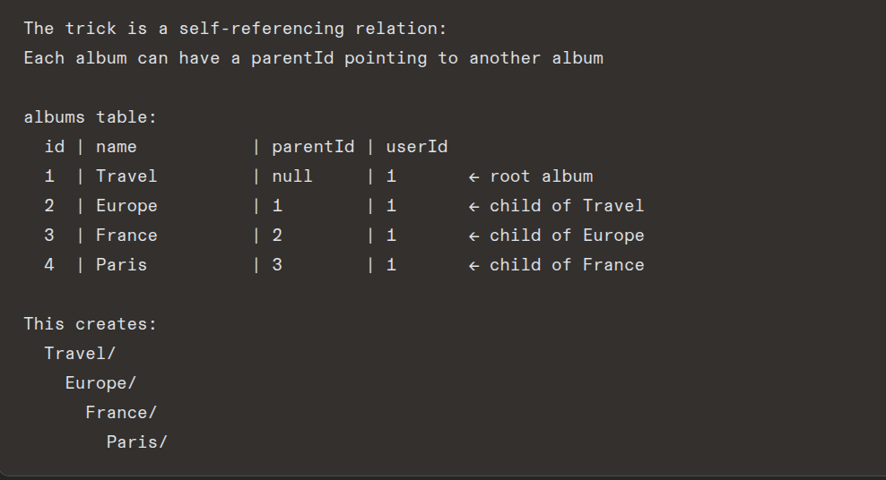

# What's new

# 1. Upload without an album

Add a special built-in album called "Uncategorized"
that is created automatically when a user signs up.
Photos can be uploaded to this album when user has
no albums or does not want to organize yet.

OR

Make albumId optional in the schema.
Photos without an album just float freely.
Show them in a separate "All Photos" section.

# 2. Nested Albums (Sub-albums)

Q1+Q2: secure_url vs public_id:
secure_url → full web address → use in browser (img src, download link)
public_id → Cloudinary's internal id → use on server (delete, transform)
Save BOTH in your database

Q3: Download opens instead of downloads:
Add fl_attachment to the Cloudinary URL:
photo.url.replace("/upload/", "/upload/fl_attachment/")
This forces Content-Disposition: attachment → browser downloads

Expectation 1a: Upload without album:
Make albumId optional (Int?) in schema
Show "No Album" option in dropdown
Show unorganized photos separately on dashboard

Expectation 1b: Nested albums:
Add parentId to Album model (self-reference)
parentId = null → root album
parentId = 1 → child of album 1
Show children inside parent album detail page

Expectation 2: Share with time-limited link:
Add shareId (UUID) and shareExpiry to Album
POST /albums/:id/share → generate UUID → calculate expiry → save
GET /share/:shareId → find album → check expiry → show public page
No auth middleware on share route (public access)
